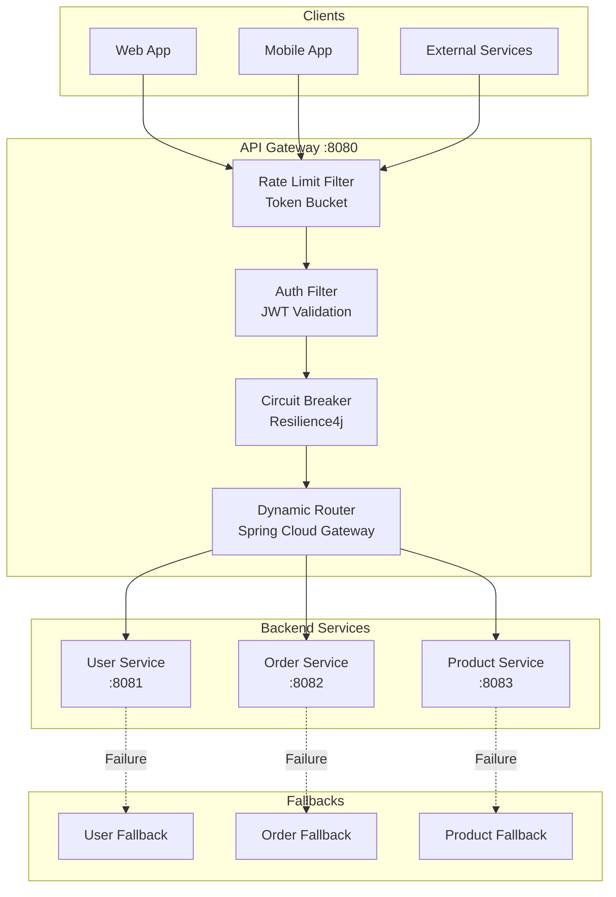

# API Rate Limiting Gateway

[](https://openjdk.org/)
[](https://spring.io/projects/spring-boot)
[](https://docs.springframework.io/spring-framework/reference/web/webflux.html)
[](Dockerfile)
[](LICENSE)
[](https://github.com/jzavalaq/api-rate-limiting-gateway/actions/workflows/ci.yml)

> A reactive API Gateway with token bucket rate limiting, JWT authentication, circuit breaker, and dynamic routing using Spring Cloud Gateway and WebFlux.

**Live Demo:** _Coming soon_ | **Swagger UI:** _Coming soon_

---

## Key Features

- **Token Bucket Rate Limiting**: Configurable requests per minute/hour using Bucket4j
- **Reactive Stack**: Non-blocking I/O with Spring WebFlux for high concurrency
- **Circuit Breaker**: Resilience4j integration with fallback responses
- **JWT Authentication**: Secure token-based authentication with role validation
- **Dynamic Routing**: Spring Cloud Gateway for flexible request routing
- **Request Correlation**: Distributed tracing with correlation IDs
- **OpenAPI Documentation**: Swagger UI for API exploration

---

## Architecture



---

## Rate Limiting Strategy

The gateway implements **token bucket algorithm** via Bucket4j:

```
┌─────────────────────────────────────────────────────────┐
│                   Token Bucket                          │
│  ┌─────────────────────────────────────────────────┐   │
│  │  Tokens: ████████████████████████████░░░░░░░░░░ │   │
│  │  Capacity: 100 tokens                           │   │
│  │  Refill: 60 tokens/minute                       │   │
│  └─────────────────────────────────────────────────┘   │
│                                                         │
│  Request arrives → Token available? → Forward request   │
│                         ↓ No                            │
│                   Return 429 Too Many Requests          │
└─────────────────────────────────────────────────────────┘
```

### Rate Limit Headers

Every response includes rate limit information:

```
X-RateLimit-Limit: 100
X-RateLimit-Remaining: 95
X-RateLimit-Reset: 1648764234
```

---

## Circuit Breaker Pattern

Resilience4j circuit breaker protects against cascading failures:

| State | Behavior |
|-------|----------|
| **CLOSED** | Requests flow normally |
| **OPEN** | Requests fail fast, return fallback |
| **HALF_OPEN** | Limited requests test if service recovered |

### Configuration

```yaml
resilience4j.circuitbreaker:
  sliding-window-size: 10
  failure-rate-threshold: 50
  wait-duration-in-open-state: 60s
  permitted-number-of-calls-in-half-open-state: 3
```

---

## Architectural Decisions

| Decision | Rationale |
|----------|-----------|
| **Reactive Stack** | Non-blocking I/O handles 10x more concurrent connections |
| **Token Bucket** | Smooth traffic flow, prevents burst overload |
| **Per-Client Limits** | Rate limits keyed by IP or API key |
| **Fallback Responses** | Graceful degradation instead of errors |
| **Correlation IDs** | Distributed tracing across services |

---

## Tech Stack

| Technology | Version | Purpose |
|------------|---------|---------|
| Java | 21 | Runtime environment |
| Spring Boot | 3.2.5 | Application framework |
| Spring Cloud Gateway | 2023.0.1 | API Gateway / Routing |
| Spring WebFlux | - | Reactive programming |
| Bucket4j | 8.7.0 | Rate limiting |
| Resilience4j | 2.2.0 | Circuit breaker |
| SpringDoc OpenAPI | 2.5.0 | API documentation |

---

## Quick Start

### Option 1: Docker Compose (Recommended)

```bash
# Clone the repository
git clone https://github.com/jzavalaq/api-rate-limiting-gateway.git
cd api-rate-limiting-gateway

# Copy environment file
cp .env.example .env

# Start the gateway
docker-compose up -d

# View logs
docker-compose logs -f app
```

Services available:
- **Gateway:** http://localhost:8080
- **Swagger UI:** http://localhost:8080/swagger-ui.html
- **Health Check:** http://localhost:8080/actuator/health

### Option 2: Local Development

```bash
# Build and run
mvn spring-boot:run

# With custom rate limits
RATE_LIMIT_RPM=100 RATE_LIMIT_RPH=2000 mvn spring-boot:run
```

---

## API Examples

### Health Check

```bash
# Gateway health
curl http://localhost:8080/actuator/health

# Custom health endpoint
curl http://localhost:8080/api/v1/health
```

### Rate Limiting Demo

```bash
# Make 105 requests - last 5 will return 429
for i in {1..105}; do
  curl -w "%{http_code}\n" -o /dev/null -s http://localhost:8080/api/v1/health
done
```

### Protected Routes

```bash
TOKEN="your-jwt-token"

# Access protected user service
curl http://localhost:8080/api/v1/users \
  -H "Authorization: Bearer $TOKEN"

# Access protected order service
curl http://localhost:8080/api/v1/orders \
  -H "Authorization: Bearer $TOKEN"

# Check rate limit headers
curl -I http://localhost:8080/api/v1/users \
  -H "Authorization: Bearer $TOKEN"
```

### Circuit Breaker Fallbacks

```bash
# When backend is unavailable, fallback is returned
curl http://localhost:8080/api/v1/fallback/users
# {"status":"error","message":"User service temporarily unavailable"}
```

---

## Configuration

### Environment Variables

| Variable | Description | Default |
|----------|-------------|---------|
| `SERVER_PORT` | Server port | 8080 |
| `SPRING_PROFILES_ACTIVE` | Active profile | dev |
| `JWT_SECRET` | JWT signing key (256+ bits) | _Required_ |
| `JWT_EXPIRATION` | Token expiration (ms) | 86400000 |
| `RATE_LIMIT_RPM` | Requests per minute | 60 |
| `RATE_LIMIT_RPH` | Requests per hour | 1000 |
| `ALLOWED_ORIGINS` | CORS origins | `http://localhost:3000` |
| `SERVICES_USER_URL` | User service URL | `http://localhost:8081` |
| `SERVICES_ORDER_URL` | Order service URL | `http://localhost:8082` |
| `SERVICES_PRODUCT_URL` | Product service URL | `http://localhost:8083` |

---

## API Endpoints

| Method | Path | Description | Auth |
|--------|------|-------------|------|
| GET | `/api/v1` | Gateway information | No |
| GET | `/api/v1/health` | Health check | No |
| GET | `/actuator/health` | Actuator health | No |
| GET | `/swagger-ui.html` | OpenAPI UI | No |
| ANY | `/api/v1/users/**` | User service routes | JWT |
| ANY | `/api/v1/orders/**` | Order service routes | JWT |
| ANY | `/api/v1/products/**` | Product service routes | JWT |
| GET | `/api/v1/fallback/*` | Service fallbacks | No |

---

## Project Structure

```
src/main/java/com/jzavalaq/gateway/
├── config/              # Security, routing configuration
├── ratelimit/           # Rate limiting filter and service
├── circuitbreaker/      # Circuit breaker configuration
├── security/            # JWT authentication filter
├── routing/             # Route configuration
├── filter/              # Request logging, security headers
├── controller/          # Fallback and health endpoints
├── dto/                 # Response DTOs
├── exception/           # Custom exceptions
└── util/                # Client IP resolver, correlation ID
```

---

## Testing

```bash
# Run all tests
mvn test

# Run with coverage
mvn test jacoco:report
```

---

## License

This project is licensed under the MIT License - see the [LICENSE](LICENSE) file for details.

---

## Author

**Juan Zavala** - [GitHub](https://github.com/jzavalaq) - [LinkedIn](https://linkedin.com/in/juanzavalaq)
